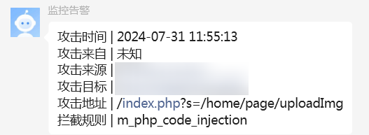

## 介绍



雷池烽火瞭望塔

一个用于通知所接受到的雷池攻击事件的服务

# 配置

启动之后可以在 `config/config.yml` 中配置：

```yaml
# 激活的通知服务
active:
  # 企业微信
  - we-com
# 企业微信配置
we-com:
  # webhook key
  key: ''
  # 通知模板
  template: |
    攻击时间 | {time}
    攻击来自 | {from}
    攻击来源 | {ip}
    攻击目标 | {target}
    攻击地址 | {path}
    拦截规则 | {rule_id}
  # 攻击规则过滤，匹配到才通知
  rule-filter:
    # 规则 ID
    rule-id:
      # 正则匹配，非 “/”开头和非“m_scanner”
      # 过滤的两个分别是非长亭社区黑名单和扫描器
      pattern: '^(?!/)(?!.*m_scanner).*$'
```

# 运行环境

- Python 3.8
- tornado>=6.4.1
- pyyaml>=6.0.1
- requests>=2.23.3

# 运行

## 安装依赖

```bash
pip3 install -r requirements.txt
```

## 执行

```bash
python3 main.py
```

### 可选参数

| 参数              | 类型  | 说明       |
|-----------------|-----|----------|
| `--port`        | 整数  | 监听端口     |
| `--host`        | 字符串 | 监听地址     |
| `--config_path` | 字符串 | 配置文件所在路径 |


# 请求推送通知

- 路径：http://localhost:8015/api
- 方法 POST

| 参数        | 类型  | 说明                        |
|-----------|-----|---------------------------|
| `id`      | 整数  | 事件 ID                     |
| `time`    | 字符串 | 格式如 `2024-07-26 06:36:05` |
| `from`    | 字符串 | 攻击来源                      |
| `ip`      | 字符串 | IP 地址                     |
| `target`  | 字符串 | 攻击目标                      |
| `path`    | 字符串 | 攻击路径                      |
| `rule_id` | 字符串 | 规则 ID                     |

## 示例

```json
[
    {
        "time": "2024-07-26 03:17:33",
        "from": "上海市上海市",
        "ip": "58.34.1.19",
        "target": "8.8.8.8:9080",
        "path": "/service/extdirect",
        "rule_id": "m_rule/33e75ff09dd601bbe69f351039152189",
        "id": 4934902
    }
]
```

# TODO

- [ ] 添加邮件通知
